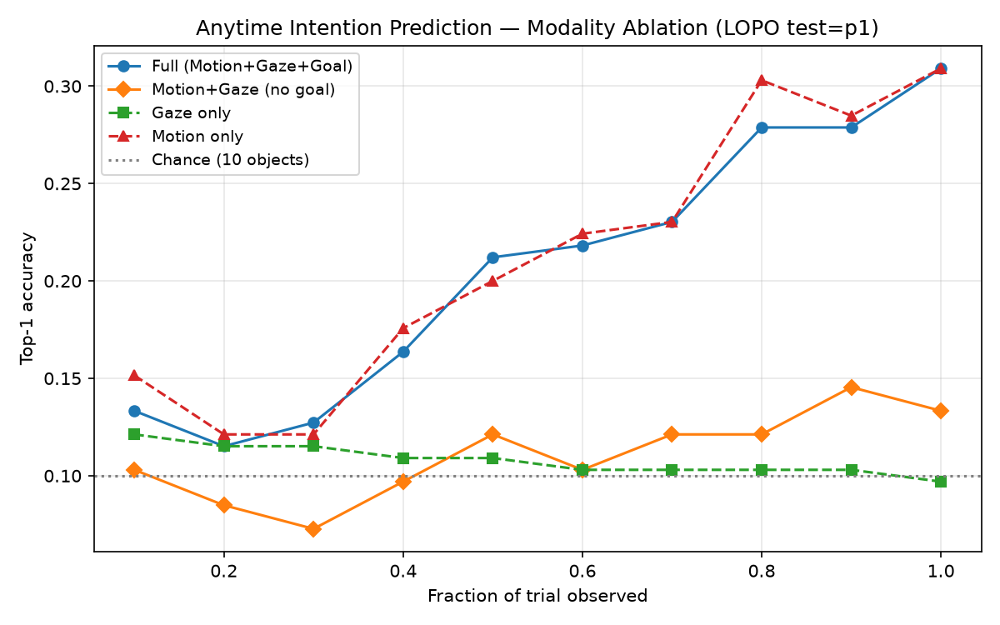
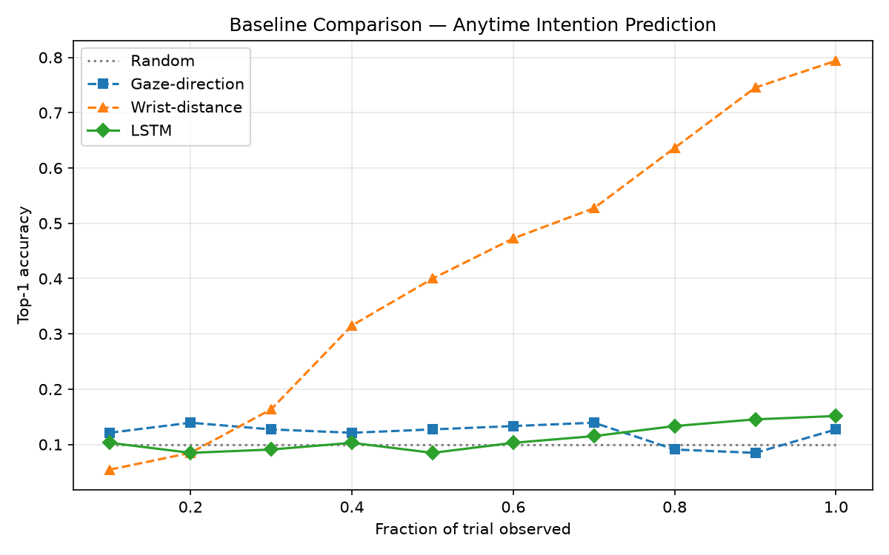

# Human Intention Prediction for Human-Robot Collaboration

This project explores whether human intention can be predicted early during object-reaching actions using motion and eye-gaze information.

Given a partial observation of a person reaching toward an object, the model predicts which of 10 possible objects the person intends to pick up. The main goal is to study how early the target can be identified before it becomes clear from the wrist trajectory alone.

The project uses the [MoGaze](https://humans-to-robots-motion.github.io/mogaze/) dataset from Kratzer et al., IEEE RA-L 2021. MoGaze contains about 180 minutes of motion-capture and synchronized eye-gaze data from 7 participants interacting with 10 manipulable objects: 4 cups, 4 plates, a jug, and a bowl.

## Motivation

In human-robot collaboration, it can be useful for a robot to understand what a person is trying to do before the action is complete.

For example, if a robot can estimate which object a person is reaching for, it could begin preparing for assistance instead of waiting until the person completes the reach.

This project focuses on the perception side of that problem. I use motion, gaze, and object-relative information to study how intention prediction changes as more of the reaching action becomes visible.

## Results

### Full LOPO Cross-Validation

I evaluated the model using leave-one-participant-out (LOPO) cross-validation across the 6 participants with usable gaze data. `p3` was skipped because the gaze file was unavailable.

For each fold, one participant was completely held out for testing. The remaining participants were used for training. An inner 15% validation split from the training data was used for checkpoint selection, so the held-out participant was not used during training or model selection.

### Mean Results Across 6 Participants

| Frac observed |  Mean acc |       Std |   Min |   Max | Chance |
| ------------- | --------: | --------: | ----: | ----: | -----: |
| 10%           |     12.2% |     ±2.1% |  9.5% | 14.8% |  10.0% |
| 20%           |     12.4% |     ±3.6% |  8.0% | 18.4% |  10.0% |
| 30%           |     13.9% |     ±2.4% | 10.8% | 16.8% |  10.0% |
| 50%           |     15.5% |     ±2.3% | 11.3% | 18.9% |  10.0% |
| 70%           |     20.3% |     ±3.4% | 13.6% | 24.1% |  10.0% |
| 80%           |     23.7% |     ±3.5% | 16.4% | 27.9% |  10.0% |
| **90%**       | **27.4%** | **±4.4%** | 19.2% | 32.8% |  10.0% |
| 100%          |     29.5% |     ±6.2% | 16.4% | 36.3% |  10.0% |

The average accuracy increases as more of the reaching action is observed. It starts at 12.2% with 10% of the trial observed and reaches 29.5% when the full trial is available.

There is also noticeable variation between participants, especially during the earlier parts of the reaching action.

### Per-Participant Results at 90% Observation

| Participant |  Acc @90% | Test trials |
| ----------- | --------: | ----------: |
| p1          |     26.7% |         165 |
| p2          |     26.5% |         196 |
| p4          |     31.6% |         190 |
| p5          |     27.7% |         195 |
| p6          |     19.2% |         213 |
| p7          |     32.8% |         241 |
| **Mean**    | **27.4%** |           — |

The differences between participants show why participant-independent evaluation is important for this type of behavioral data.

## Modality Ablation

The modality ablation shown below is currently based on the `p1` fold.

I tested the model with different sources of information to understand the contribution of motion, gaze, and goal-relative features.

The goal-relative features generally helped compared with using the motion and gaze CNN streams alone after the earliest observation point. At 10% observation, the version without goal-relative features performed slightly better.



## Baseline Comparison

The baseline results below are also from the `p1` fold and are separate from the six-participant LOPO averages reported above.

| Frac | Full model | Wrist-dist | Gaze-dir |  LSTM | Random |
| ---- | ---------: | ---------: | -------: | ----: | -----: |
| 10%  |  **13.3%** |       5.5% |    12.1% | 10.3% |  10.0% |
| 30%  |  **12.7%** |      16.4% |    12.7% |  9.1% |  10.0% |
| 50%  |  **21.2%** |      40.0% |    12.7% |  8.5% |  10.0% |
| 90%  |      27.9% |  **74.5%** |     8.5% | 14.5% |  10.0% |

The wrist-distance baseline becomes much stronger later in the trial. This makes sense because the target becomes easier to identify once the wrist gets closer to the object.

The earlier part of the action is more difficult because wrist proximity contains less information. This is the part of the task where combining motion, gaze, and object-relative information is most interesting.



## Model

The model combines motion, gaze, and spatial information before processing the sequence with a Transformer.

* **Causal CNNs:** Separate 1D CNNs process the 66-dimensional joint-angle motion and 3-dimensional gaze direction. Left-only padding is used so the CNN does not access future frames.
* **Goal-relative features:** Gaze alignment and wrist proximity are calculated for each of the 10 candidate objects.
* **Feature fusion:** Motion, gaze, and goal-relative features are combined before the Transformer.
* **Causal Transformer:** A causal attention mask prevents the model from attending to future timesteps.
* **Per-timestep prediction:** The model produces a prediction at every timestep, which makes it possible to evaluate performance at different observation fractions.
* **Training loss:** Very early timesteps are initially excluded from the loss. The cutoff decreases from 15% to 10% during training.

## Evaluation

For each LOPO fold:

1. One participant is held out for testing.
2. The remaining participants are used for training.
3. 15% of the training trials are used for validation and checkpoint selection.
4. The held-out participant is evaluated only after the model has been selected.

I also took care to keep the modality ablations separate:

* **Gaze only:** Motion and `wrist_xyz` are removed so wrist information does not leak into the gaze-only experiment.
* **No goal features:** The goal-relative feature branch is disabled while keeping both the motion and gaze CNNs active.
* **LSTM:** The LSTM uses an internal validation split from the training data. The held-out test participant is not used for model selection.

## Limitations and Future Work

This project currently evaluates intention prediction offline using MoGaze. There are several directions I would like to explore next.

* **Real-time inference:** The model is causal, but the current implementation is not optimized for streaming inference. A future version could reuse previous temporal representations instead of repeatedly processing the available sequence.
* **More participant data:** MoGaze has a relatively small number of participants. Temporal augmentation and small spatial transformations could be explored to improve generalization while keeping motion, gaze, and object coordinates consistent.
* **Real-time preprocessing:** Wrist positions are currently calculated using forward kinematics during offline trial extraction. For a real robot system, this preprocessing could be made incremental or batched.
* **Full baseline evaluation:** The main model has been evaluated using six-participant LOPO, while the baseline and modality-ablation comparisons are currently from the `p1` fold. Running these comparisons across all LOPO folds would provide a stronger comparison.
* **Robot evaluation:** A future step would be to connect the intention predictions to a robot and study whether they can help the robot respond earlier during a collaborative task.

## Setup

Install the required Python packages:

```bash
pip install -r requirements.txt
```

Install `humoro`:

```bash
git clone https://github.com/PhilippJKratzer/humoro.git
cd humoro
pip install -r requirements.txt
pip install .
cd ..
```

Download the MoGaze dataset from:

```text
https://humans-to-robots-motion.github.io/mogaze/
```

Place it under:

```text
data/mogaze/
```

## Running

### Check the Model

```bash
python models/cnn_transformer.py
```

### Run the Synthetic Sanity Check

```bash
python data/sanity_check_baseline.py
```

### Train One LOPO Fold

For example, to hold out `p1`:

```bash
python train.py --epochs 30 --data mogaze \
  --mogaze_path data/mogaze \
  --n_goals 10 \
  --motion_dim 66 \
  --test_pid p1
```

### Evaluate the Fold

```bash
python evaluate.py \
  --n_goals 10 \
  --motion_dim 66 \
  --mogaze_path data/mogaze \
  --test_pid p1
```

### Run the Baselines

```bash
python baselines.py \
  --mogaze_path data/mogaze \
  --n_goals 10 \
  --motion_dim 66 \
  --test_pid p1
```

### Run Full LOPO

```bash
python run_lopo.py \
  --mogaze_path data/mogaze \
  --n_goals 10 \
  --motion_dim 66
```

This runs each of the six participants with usable gaze data as the held-out participant and reports the mean and standard deviation across all folds.
